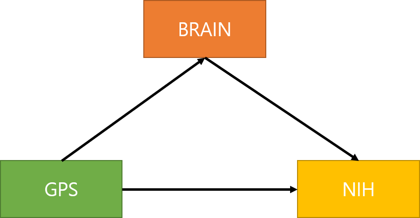
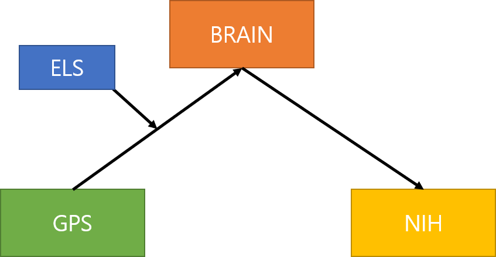
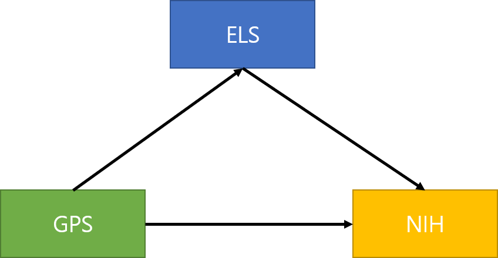

# mediation-analysis
Mediation analysis code for connectome lab. 

## Considerd Models
### Model1 
    

**Simple Mediation Model**

### Model2
   

**Moderated Mediation Model**
### Model3
     
 
**ELS as a Mediator**

## Possible Pairs of ELS-NIH
|No.|ELS|NIH|
|------|---|---|
|1|ELS_total|reading|
|2|Ab_PA|total_composite|
|3|HC_CHM|total_composite|
|4|HC_HSA|total_composite|
|5|HC_PSD|total_composite|
|6|Ne_EN|total_composite|
|7|Ne_PN|total_composite|

## Methods
1. AMOS
2. [**rosetta**](https://sci-ops.gitlab.io/rosetta-stats/moderated-mediation.html#r-5) - R package
3. [**processR**](https://rpubs.com/cardiomoon/468602) - R package
4. [**Causing**](https://github.com/HolgerBartel/Causing) - python package
